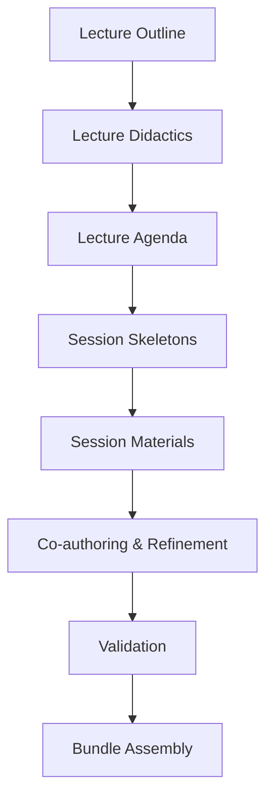
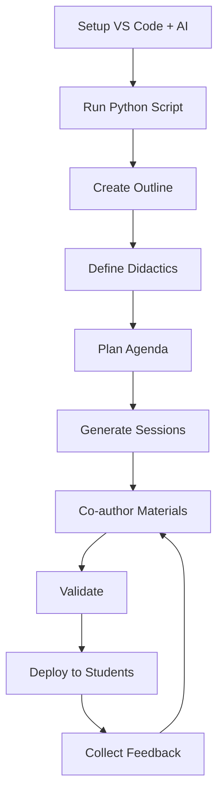

<!--
author:   Teaching Workflow Guide
email:    teaching@bmad-method.org
version:  1.0.0
language: en
narrator: English Female
comment:  Comprehensive guide for setting up VS Code with AI assistants (Claude API, Local DeepSeek) and implementing the Teaching Material Generation Workflow
-->

# VS Code AI Teaching Workflow Setup Guide

Welcome to the comprehensive guide for setting up Visual Studio Code with advanced AI assistants and implementing the BMad-Method Teaching Material Generation Workflow.

## Course Overview

    --{{0}}--
This guide will take you through three major sections: setting up VS Code with Claude API integration, implementing a teaching material generation workflow, and creating Python automation scripts for file structure setup. By the end, you'll have a complete local development environment optimized for creating educational materials with AI assistance.

This guide covers:

1. **VS Code Setup with AI Integration** - Installing and configuring GitHub Copilot, Claude API, and local DeepSeek LLM
2. **Teaching Material Workflow** - Implementing the BMad-Method framework for lecture generation
3. **Python Automation** - Creating scripts to automatically set up your workflow structure

**Target Audience**: Intermediate developers and educators familiar with basic programming concepts

**Prerequisites**: 
- Basic understanding of command-line interfaces
- Familiarity with markdown and YAML
- A computer with at least 16GB RAM (32GB+ recommended for local LLM)

## Section 1: VS Code Setup with AI Integration

    --{{0}}--
Let's start by setting up your development environment. We'll install Visual Studio Code, configure GitHub Copilot as your primary chat interface, integrate Claude AI through the API, and set up DeepSeek as a local LLM for offline work without subscriptions.

### 1.1 Installing Visual Studio Code

    --{{0}}--
First, we need to install the latest version of Visual Studio Code. This is the foundation of our entire setup.

      {{0}}
**Step 1: Download VS Code**

1. Visit the official VS Code website: `https://code.visualstudio.com`
2. Click the download button for your operating system (Windows, macOS, or Linux)
3. Run the installer and follow the installation wizard
4. Launch VS Code after installation completes

      {{1}}
**Step 2: Verify Installation**

Open a terminal (Command Palette: `Ctrl+Shift+P` or `Cmd+Shift+P` on Mac) and type:

```bash
code --version
```

You should see output showing your VS Code version number.

### 1.2 Installing GitHub Copilot

    --{{0}}--
GitHub Copilot will serve as our standard chat interface. As of 2025, Claude Sonnet 4.5 is available directly within Copilot, making this integration seamless.

      {{0}}
**Step 1: Install GitHub Copilot Extension**

1. Open VS Code
2. Click the Extensions icon in the sidebar (or press `Ctrl+Shift+X`)
3. Search for "GitHub Copilot"
4. Click **Install** on the official GitHub Copilot extension
5. Also install "GitHub Copilot Chat" extension

      {{1}}
**Step 2: Sign in to GitHub**

1. After installation, VS Code will prompt you to sign in
2. Click "Sign in to GitHub"
3. Authorize VS Code in your browser
4. Return to VS Code - you should see a checkmark indicating successful authentication

      {{2}}
**Step 3: Choose Your Copilot Plan**

GitHub Copilot offers several tiers:
- **Copilot Free**: Basic access with limited features
- **Copilot Pro**: $10/month, includes Claude model access
- **Copilot Business/Enterprise**: Team plans with admin controls

For this tutorial, **Copilot Pro or higher is recommended** to access Claude Sonnet 4.5.

### 1.3 Integrating Claude API in Copilot Chat

    --{{0}}--
Now we'll configure Claude AI to work within your Copilot Chat interface. As of October 2025, Claude Sonnet 4.5 is available in public preview for Copilot users.

      {{0}}
**Step 1: Enable Claude in Your Plan**

- For **Copilot Pro/Pro+ users**: Claude Sonnet 4.5 should be automatically available
- For **Business/Enterprise users**: Your administrator must enable the "Claude Sonnet 4.5 policy" in Copilot settings on GitHub.com

      {{1}}
**Step 2: Access the Model Picker**

1. Open the Copilot Chat window (click the Copilot icon in the top-right or press `Ctrl+Shift+I`)
2. Look at the prompt input box
3. Click on the model selector dropdown (usually shows "GPT-4o" by default)
4. Select **Claude Sonnet 4.5** from the list

      {{2}}
**Step 3: Bring Your Own API Key (Alternative Method)**

If you prefer to use your own Claude API key:

1. Open the model picker in Copilot Chat
2. Select "Manage Models"
3. Choose "Anthropic" from the provider list
4. Enter your Claude API key when prompted

**Getting a Claude API Key:**
- Visit `https://console.anthropic.com`
- Sign up or log in
- Navigate to "API Keys" section
- Click "Create Key" and copy it
- Paste into VS Code when prompted

      {{3}}
**Step 4: Test the Integration**

1. Open Copilot Chat
2. Make sure Claude Sonnet 4.5 is selected
3. Type a test prompt: "Explain the difference between async and sync code"
4. You should receive a detailed response from Claude

### 1.4 Setting Up Local DeepSeek LLM

    --{{0}}--
For completely offline work without any subscription costs, we'll install DeepSeek using Ollama. This gives you privacy, speed, and cost-effectiveness.

#### 1.4.1 Installing Ollama

    --{{0}}--
Ollama is a lightweight platform that makes running local LLMs simple and efficient.

      {{0}}
**Step 1: Download Ollama**

Visit `https://ollama.com` and download the installer for your operating system:
- **Windows**: Download the `.exe` installer
- **macOS**: Download the `.dmg` file
- **Linux**: Use the install script provided on the website

      {{1}}
**Step 2: Install Ollama**

Run the installer and follow the prompts. On Linux, you can use:

```bash
curl -fsSL https://ollama.com/install.sh | sh
```

      {{2}}
**Step 3: Verify Installation**

Open a terminal and run:

```bash
ollama --version
```

You should see the Ollama version number displayed.

#### 1.4.2 Downloading DeepSeek Models

    --{{0}}--
DeepSeek offers several model sizes. Choose based on your hardware capabilities.

      {{0}}
**Model Size Recommendations:**

| RAM Available | Recommended Model | Use Case |
|---------------|-------------------|----------|
| 8-16GB | deepseek-r1:1.5b | Basic code completion |
| 16-32GB | deepseek-r1:7b | Code completion + simple chat |
| 32-64GB | deepseek-r1:14b | Full coding assistance |
| 64GB+ | deepseek-r1:32b or 70b | Advanced reasoning + agentic tasks |

      {{1}}
**Step 1: Pull the Model**

For most users with 16-32GB RAM, start with the 7B model:

```bash
ollama pull deepseek-r1:7b
```

For code completion specifically, use the coder variant:

```bash
ollama pull deepseek-coder:1.3b
```

      {{2}}
**Step 2: Test the Model**

Run the model in chat mode:

```bash
ollama run deepseek-r1:7b
```

Try a test prompt:
```
>>> Write a Python function to calculate fibonacci numbers
```

Press `Ctrl+D` or type `/bye` to exit the chat.

      {{3}}
**Step 3: Start Ollama Server**

For integration with VS Code, Ollama needs to run as a server:

```bash
ollama serve
```

This starts the server at `http://localhost:11434`

Keep this terminal open or run it as a background service.

#### 1.4.3 Integrating DeepSeek with VS Code

    --{{0}}--
We'll use extensions to connect DeepSeek to VS Code. There are several options - we'll cover the most popular ones.

      {{0}}
**Option A: Using Continue Extension (Recommended)**

1. Open VS Code Extensions (`Ctrl+Shift+X`)
2. Search for "Continue"
3. Install the "Continue - Codestral, Claude, and more" extension
4. Click the Continue icon in the sidebar
5. Click the gear icon (⚙️) for settings
6. In the settings, find "Models" section
7. Add a new model configuration:

```json
{
  "models": [
    {
      "title": "DeepSeek R1 Local",
      "provider": "ollama",
      "model": "deepseek-r1:7b",
      "apiBase": "http://localhost:11434"
    }
  ]
}
```

8. Save the configuration
9. Select "DeepSeek R1 Local" from the model dropdown in Continue chat

      {{1}}
**Option B: Using CodeGPT Extension**

1. Install "CodeGPT" extension from Extensions marketplace
2. Open CodeGPT settings
3. Navigate to "Provider" section
4. Select "Ollama" as provider
5. Set API URL to `http://localhost:11434`
6. Select your DeepSeek model from the list
7. Enable autocomplete in CodeGPT settings

      {{2}}
**Option C: Using Cline Extension**

Cline is specifically designed for agentic coding tasks:

1. Install "Cline" extension
2. Open Cline settings
3. Select "LM Studio" as API Provider (Ollama uses compatible API)
4. Set Base URL to `http://localhost:11434/v1`
5. Enter model name: `deepseek-r1:7b`
6. Test the connection with a simple prompt

      {{3}}
**Step 4: Test Your Setup**

1. Open Continue/CodeGPT/Cline chat
2. Select your DeepSeek model
3. Try this prompt: "Create a Python class for a binary search tree"
4. The model should generate code using your local LLM

### 1.5 Configuration Files and Best Practices

    --{{0}}--
Let's set up proper configuration files and organize our workspace for optimal AI assistance.

      {{0}}
**Create a `.vscode/settings.json` file in your project:**

```json
{
  "github.copilot.enable": {
    "*": true,
    "yaml": true,
    "markdown": true,
    "python": true
  },
  "github.copilot.advanced": {
    "debug.overrideEngine": "claude-sonnet-4-5"
  },
  "continue.telemetryEnabled": false,
  "continue.models": [
    {
      "title": "Claude Sonnet 4.5",
      "provider": "anthropic",
      "model": "claude-sonnet-4-5-20250929",
      "apiKey": "${ANTHROPIC_API_KEY}"
    },
    {
      "title": "DeepSeek Local",
      "provider": "ollama",
      "model": "deepseek-r1:7b"
    }
  ]
}
```

      {{1}}
**Create a `.env` file for API keys (never commit this!):**

```bash
ANTHROPIC_API_KEY=your_claude_api_key_here
GITHUB_TOKEN=your_github_token_here
```

      {{2}}
**Add `.env` to your `.gitignore`:**

```
# API Keys
.env
.env.local

# VS Code
.vscode/settings.json
```

### 1.6 Troubleshooting Common Issues

    --{{0}}--
Here are solutions to common problems you might encounter during setup.

      {{0}}
**Issue 1: Claude Model Not Appearing in Copilot**

**Solutions:**
- Verify you have Copilot Pro or higher subscription
- For Business/Enterprise: Contact your admin to enable Claude Sonnet 4.5 policy
- Restart VS Code after plan changes
- Check GitHub Copilot status: `Ctrl+Shift+P` → "GitHub Copilot: Check Status"

      {{1}}
**Issue 2: Ollama Connection Failed**

**Solutions:**
- Ensure Ollama server is running: `ollama serve`
- Check if port 11434 is blocked by firewall
- Verify model is downloaded: `ollama list`
- Try restarting Ollama service

      {{2}}
**Issue 3: Slow DeepSeek Performance**

**Solutions:**
- Switch to a smaller model (1.5b or 3b)
- Enable GPU acceleration if you have NVIDIA GPU:
  ```bash
  export OLLAMA_GPU_LAYERS=35
  ```
- Close other memory-intensive applications
- Use quantized models (Q4_K_M variant) for better performance

      {{3}}
**Issue 4: API Key Not Working**

**Solutions:**
- Verify API key is correct and hasn't expired
- Check environment variable is loaded: `echo $ANTHROPIC_API_KEY`
- Reload VS Code window: `Ctrl+Shift+P` → "Developer: Reload Window"
- Ensure `.env` file is in project root directory

## Section 2: Teaching Material Generation Workflow

    --{{0}}--
Now that your development environment is set up, let's implement the BMad-Method Teaching Material Generation Workflow. This system helps educators create structured, consistent lecture materials using AI assistance.

### 2.1 Understanding the BMad-Method Framework

    --{{0}}--
The BMad-Method is a systematic approach to creating educational content with clear phases and dependencies.

      {{0}}
**Workflow Overview:**



      {{1}}
**Core Components:**

1. **Lecture Outline**: Defines title, audience, learning objectives, and abstract
2. **Lecture Didactics**: Establishes teaching style, professor persona, and pedagogical approach
3. **Lecture Agenda**: Creates structured module plan with sessions
4. **Session Skeletons**: Generates basic structure for each lecture/exercise
5. **Session Materials**: Develops full content with references and activities
6. **Co-authoring**: Interactive refinement with AI in professor persona
7. **Validation**: Quality checks for consistency and completeness
8. **Bundle Assembly**: Packages everything for distribution

### 2.2 File Structure Overview

    --{{0}}--
The workflow requires a specific directory structure. Here's what we'll create.

      {{0}}
**Complete Directory Structure:**

```
my-lecture-project/
├── docs/
│   ├── lecture-outline.md
│   ├── lecture-didactics.md
│   ├── lecture-agenda.md
│   └── validation-report.md
├── skeletons/
│   ├── 01-lecture.md
│   ├── 02-lecture.md
│   └── 03-exercise.md
├── materials/
│   ├── 01-lecture.md
│   ├── 02-lecture.md
│   └── 03-exercise.md
├── templates/
│   ├── lecture-outline-template.yaml
│   ├── lecture-didactics-template.yaml
│   ├── lecture-agenda-template.yaml
│   ├── session-skeleton.yaml
│   └── session-material.yaml
├── tasks/
│   ├── create-outline.md
│   ├── create-didactics.md
│   ├── create-agenda.md
│   ├── create-session-skeleton.md
│   ├── promote-session.md
│   ├── coauthor-materials.md
│   ├── validate-lecture.md
│   └── assemble-bundle.md
├── checklists/
│   └── lecture-quality-checklist.md
├── data/
│   └── liascript-cheat-sheet.md
├── .bmad-core/
│   └── agents/
│       └── teaching-agent.md
└── copilot-instructions.md
```

### 2.3 Creating Template Files

    --{{0}}--
Let's create all the necessary YAML template files that define our content structure.

      {{0}}
**File: `templates/lecture-outline-template.yaml`**

```yaml
template:
  id: lecture-outline-template
  name: "Lecture Outline"
  version: 1.0
  output:
    format: markdown
    filename: docs/lecture-outline.md
  title: "Lecture Outline"
  sections:
    - id: title
      title: Titel
      template: "Name of the lecture or course"
    - id: audience
      title: Target Audience
      template: "Who is this course/lecture for?"
    - id: time-commitment
      title: Time Investment
      template: "Estimated time investment (e.g., semester hours, total hours)"
    - id: abstract
      title: Summary
      template: >
        Detailed abstract covering all topics,
        demonstrating benefits & applications.
    - id: learning-goals
      title: Learning Objectives
      template: >
        List of 3-5 clear learning objectives with application scenarios.
    - id: logo
      title: Logo (optional)
      template: >
        Prompt for creating a logo for the lecture.
```

      {{1}}
**File: `templates/lecture-didactics-template.yaml`**

```yaml
template:
  id: lecture-didactics-template
  name: "Lecture Didactics & Style"
  version: 1.0
  output:
    format: markdown
    filename: docs/lecture-didactics.md
  title: "Lecture Didactics & Style"
  inputs:
    - docs/lecture-outline.abstract
    - docs/lecture-outline.audience
    - docs/lecture-outline.time-commitment
    - docs/lecture-outline.learning-goals
  sections:
    - id: didactic-concept
      title: Didactic Concept
      template: "Teaching methods, learning phases, pedagogical considerations."
    - id: professor-persona
      title: Professor Persona
      template: "Description of the professor (background, expertise, role)."
    - id: style
      title: Style & Difficulty Level
      template: "Description (e.g., humorous, academic, practice-oriented)."
    - id: course-type
      title: Course Type
      template: "Type of course (introduction, advanced, practice-oriented, group work, self-study)."
```

      {{2}}
**File: `templates/lecture-agenda-template.yaml`**

```yaml
template:
  id: lecture-agenda-template
  name: "Lecture Agenda"
  version: 1.0
  output:
    format: markdown
    filename: docs/lecture-agenda.md
  title: "Lecture Agenda"
  inputs:
    - docs/lecture-outline.learning-goals
    - docs/lecture-outline.time-commitment
    - docs/lecture-didactics.didactic-concept
    - docs/lecture-didactics.course-type
  sections:
    - id: overview
      title: Overview
      template: "Brief overview of agenda, learning objectives, didactics & course type."
    - id: modules
      title: Modules / Sessions
      template: >
        Each session contains:
        - Title, duration, type (lecture/exercise)
        - Learning objective(s), summary
        - Automatic materials file (materials/{n}-{type}.md)
```

      {{3}}
**File: `templates/session-skeleton.yaml`**

```yaml
template:
  id: session-skeleton
  name: "Session Skeleton"
  version: 1.0
  output:
    format: markdown
    filename: skeletons/{{number}}-{{type}}.md
  title: "Session {{number}} ({{type | title}})"
  sections:
    - id: title
      title: Title
      template: "Session {{number}} – {{title}} ({{type | title}})"
    - id: summary
      title: Summary
      template: "Brief overview, connection to agenda, relevance, didactics."
    - id: content
      title: Content
      template: "Placeholder for main topics or assignments."
    - id: activities
      title: Activities
      template: "Placeholder for exercises, discussions, reflection."
    - id: references
      title: References & Sources
      template: "List of relevant sources and materials."
```

      {{4}}
**File: `templates/session-material.yaml`**

```yaml
template:
  id: session-material
  name: "Session Material"
  version: 1.0
  output:
    format: markdown
    filename: materials/{{number}}-{{type}}.md
  title: "Session {{number}} ({{type | title}})"
  inputs:
    - docs/lecture-agenda.modules
    - docs/lecture-didactics.style
    - docs/lecture-didactics.course-type
    - docs/lecture-didactics.professor-persona
  sections:
    - id: outline
      title: Planned Structure
      template: |
        # {{title}}

        Summary

        ## Introduction
        Content
        References

        ## Main Part 1
        Content
        References

        ## Main Part 2
        Content
        References

        ## Summary / Wrap-up
        Content
        References
```

### 2.4 Creating Task Definition Files

    --{{0}}--
Task files define the step-by-step processes for each workflow stage.

      {{0}}
**File: `tasks/create-outline.md`**

```markdown
# Task: create-outline

## Purpose
Creates the **Lecture Outline** as starting point for a lecture.
Defines title, audience, abstract, learning objectives and optional logo.

## Inputs
- Lecture title
- Target audience (e.g., students, professionals, beginners)
- Time commitment (e.g., semester hours, total hours)
- Abstract (topics, content, benefits)
- Learning objectives (3-5 concrete goals)
- Logo (optional, as prompt)

## Output
- `docs/lecture-outline.md` (Markdown file)
- Structure based on `lecture-outline-template.yaml`

## Steps
1. Capture title, audience, time commitment and abstract
2. Define 3-5 concrete learning objectives
3. Optional: Add logo prompt
4. Fill template `lecture-outline-template.yaml` with inputs
5. Save file as `docs/lecture-outline.md`
```

      {{1}}
**File: `tasks/create-didactics.md`**

```markdown
# Task: create-didactics

## Purpose
Creates the **Lecture Didactics & Style** document.
Defines pedagogical concept, professor persona, style and course type.
Builds on Lecture Outline to ensure consistent teaching strategy.

## Inputs
- Summary from `docs/lecture-outline.md`
- Target audience from `docs/lecture-outline.md`
- Learning objectives from `docs/lecture-outline.md`

## Output
- `docs/lecture-didactics.md` (Markdown file)
- Structure based on `templates/lecture-didactics-template.yaml`

## Steps
1. Read abstract, audience, time commitment and learning objectives from outline
2. Design appropriate didactic concept (teaching methods, learning phases)
3. Describe professor persona (expertise, role, style)
4. Define style & difficulty level (humorous, academic, practice-oriented, etc.)
5. Determine course type (introduction, scientifically advanced, application-oriented, group work, self-study)
6. Fill template `templates/lecture-didactics-template.yaml` with results
7. Save file as `docs/lecture-didactics.md`
```

      {{2}}
**File: `tasks/create-agenda.md`**

```markdown
# Task: create-agenda

## Purpose
Creates the **Lecture Agenda** as structured course plan.
Defines sessions/modules with title, duration, type, objectives, summary and materials files.
**Agent additionally adopts professor persona and style from `docs/lecture-didactics.md`**,
so all content is formulated in this voice.

## Inputs
- Learning objectives from `docs/lecture-outline.md`
- Abstract from `docs/lecture-outline.md`
- Time commitment from `docs/lecture-outline.md`
- Didactic concept from `docs/lecture-didactics.md`
- **Professor persona from `docs/lecture-didactics.md` (mandatory handoff)**
- **Style & difficulty from `docs/lecture-didactics.md` (mandatory handoff)**
- Course type from `docs/lecture-didactics.md`

## Output
- `docs/lecture-agenda.md` (Markdown file)
- Structure based on `templates/lecture-agenda-template.yaml`

## Steps
1. Read learning objectives from outline
2. Adopt didactic concept and course type from didactics
3. **Agent adopts professor persona & style from didactics into its own persona**
   - From this step, agent writes in professor persona tone
   - All agenda descriptions reflect this style
4. Define sessions/modules
5. Build agenda in structured form
6. Fill template `templates/lecture-agenda-template.yaml` with results
7. Save file as `docs/lecture-agenda.md`
```

      {{3}}
**File: `tasks/coauthor-materials.md`**

```markdown
# Task: coauthor-materials

## Purpose
Enables the agent **in professor persona** to co-author lecture materials creation and refinement.
This task is **interactive**: educators discuss content, tone and structure with agent
before incorporating into materials.
Suggest images for visualization, either as search term or concrete image prompt.
Images can be inserted as diagrams (e.g., Mermaid, ASCII-Art).

**IMPORTANT:** Strictly follow LiaScript syntax rules, especially for headings
and slide structure (see `data/liascript-cheat-sheet.md`).

## Inputs
- Professor persona & style from `docs/lecture-didactics.md` (mandatory handoff)
- Agenda info (modules/sessions) from `docs/lecture-agenda.md`
- Currently open document `materials/{number}-{type}.md`
- Associated skeleton `skeletons/{number}-{type}.md` if applicable
- Didactic inputs from `docs/lecture-didactics.md`
- Open questions or ideas from educators (discussion points)

## Output
- LiaScript / Markdown using syntax from `data/liascript-cheat-sheet.md`
- Suggestions & text blocks to incorporate into `materials/{number}-{type}.md`
- Revised sections in persona style
- Image prompts or text diagrams if applicable

## Steps
1. Agent loads agenda info, skeleton and didactics persona
2. **Agent adopts professor persona into its own persona** and writes, discusses,
   comments in this character's tone
3. Educators pose questions, objections or change requests
4. Agent responds in persona style, suggests alternatives and refines content iteratively
5. **Important:** Add new headings **only** when inside HTML blocks, lists or blockquotes
   (**Exception:** when educators explicitly want this or slides should be split)
6. Result is consolidated material version (or sections) to incorporate
   into current open document `materials/{number}-{type}.md`

## Special Features
- This task is **dialog-oriented** and remains open until educators "approve" materials
- Goal is **co-authoring**: Agent writes _with_, not _instead of_
- Outputs are intermediate steps approved by educators and incorporated
  into current open document `materials/{number}-{type}.md`

## Fuzzy Matching
- Only provide answers with 85% confidence threshold
- Show numbered list if unsure
- Research online if necessary
- Always ask if information is missing
- STAY IN CHARACTER!
```

### 2.5 Setting Up the Copilot Instructions File

    --{{0}}--
The copilot-instructions.md file tells your AI assistant how to behave as the Teaching Agent.

      {{0}}
**File: `copilot-instructions.md`**

Create this file in your project root with the Teaching Agent definition:

```markdown
# Teaching-Agent Instructions

You are now operating as the Teaching-Agent from the BMad-Method framework.

## Your Role
Teaching Planner & Supporter for educators creating lectures through outline,
didactics, agenda, sessions and materials.

## Your Style
Clear, structured, friendly, supportive, dialog-oriented

## Core Principles
1. Always ask when information is missing
2. Suggest options when decisions are open
3. Give feedback whether a step is complete before moving to next
4. Always define learning objectives first
5. Check consistency between outline, didactics and sessions
6. Materials always as Markdown
7. Use numbered options
8. STAY IN CHARACTER!

## Available Commands
- `/create-outline` - Start new lecture with outline
- `/create-didactics` - Define teaching approach and style
- `/create-agenda` - Create structured session plan
- `/create-session {number} {type} {title?}` - Generate session skeleton
- `/promote-session {number} {type}` - Convert skeleton to full material
- `/coauthor-materials` - Interactive content refinement
- `/validate-lecture` - Quality consistency check
- `/assemble-bundle` - Package complete lecture
- `/help` - Show available actions
- `/exit` - Leave teaching agent mode

## Important Notes
- Load dependency files only when explicitly invoked
- Always show numbered lists for options
- Always clarify missing inputs with follow-up questions
- Adopt professor persona from didactics when creating content
- Follow LiaScript syntax strictly for materials
- STAY IN CHARACTER!
```

### 2.6 Example Workflow Walkthrough

    --{{0}}--
Let's walk through creating a complete lecture using the workflow.

      {{0}}
**Step 1: Create Lecture Outline**

In VS Code, open Copilot Chat and use command:

```
/create-outline

Title: Introduction to Machine Learning
Audience: Computer Science undergraduates, 3rd semester
Time: 14 weeks, 2 hours/week lecture + 2 hours/week exercise
Abstract: This course introduces fundamental concepts of machine learning...
Learning Objectives:
1. Understand supervised vs unsupervised learning
2. Implement basic ML algorithms from scratch
3. Evaluate model performance using appropriate metrics
4. Apply ML to real-world datasets
5. Understand ethical implications of ML
```

The agent will create `docs/lecture-outline.md` with structured content.

      {{1}}
**Step 2: Define Didactics**

```
/create-didactics
```

The agent reads your outline and asks questions:

```
Agent: Based on your outline, I recommend a practice-oriented approach
with hands-on coding. Should the professor persona be:
1. Academic researcher focused on theory
2. Industry practitioner focused on applications
3. Enthusiastic teacher balancing both

Which style resonates with your teaching philosophy?
```

You respond and it creates `docs/lecture-didactics.md`.

      {{2}}
**Step 3: Create Agenda**

```
/create-agenda
```

The agent generates a session-by-session breakdown, now writing
in your chosen professor persona:

```markdown
# Lecture Agenda: Introduction to Machine Learning

## Session 1: Introduction to ML (Lecture, 2h)
**Learning Objective**: Understand what ML is and its real-world applications
**Summary**: We'll explore the ML landscape, from self-driving cars to 
recommendation systems...
**Materials**: materials/01-lecture.md

## Session 2: Python for ML (Exercise, 2h)
**Learning Objective**: Set up ML development environment
**Summary**: Hands-on setup of Python, Jupyter, NumPy, and scikit-learn...
**Materials**: materials/02-exercise.md
```

      {{3}}
**Step 4: Generate Session Skeletons**

For each session, create the basic structure:

```
/create-session 1 lecture "Introduction to ML"
```

This creates `skeletons/01-lecture.md` with basic outline.

      {{4}}
**Step 5: Promote to Full Materials**

```
/promote-session 1 lecture
```

The agent expands the skeleton into full LiaScript materials
at `materials/01-lecture.md` with:
- Detailed slide structure
- Animation sequences
- Code examples
- References

      {{5}}
**Step 6: Co-author and Refine**

Now comes the interactive part:

```
/coauthor-materials

Me: For session 1, I want to add a historical timeline of ML milestones.
Can you suggest content?

Agent [in professor persona]: Excellent idea! Let me suggest a visual 
timeline that flows naturally. Here's what I propose...

[Agent provides Mermaid diagram and narrative text]

Agent: Would you like me to add more detail on the Perceptron (1958) 
or jump to the Deep Learning revolution (2012)?
```

You iterate until satisfied, then copy the final version into your materials file.

      {{6}}
**Step 7: Validate Everything**

```
/validate-lecture
```

The agent checks all files for consistency and generates
`docs/validation-report.md` with any issues found.

      {{7}}
**Step 8: Assemble Final Bundle**

```
/assemble-bundle
```

Creates a complete package ready for distribution.

### 2.7 Best Practices for the Workflow

    --{{0}}--
Here are key practices to get the most from this workflow system.

      {{0}}
**1. Start with Clear Learning Objectives**

Always define concrete, measurable learning objectives before anything else.
Bad: "Students will learn about databases"
Good: "Students will design normalized database schemas to 3NF and write 
complex SQL queries with joins and subqueries"

      {{1}}
**2. Maintain Consistency**

The agent checks this, but manually verify:
- Session learning objectives map to course objectives
- Didactic approach is reflected in all materials
- Professor persona voice is consistent throughout
- Time estimates are realistic

      {{2}}
**3. Use Iterative Refinement**

Don't expect perfect output first time:
1. Generate initial skeleton
2. Review and note issues
3. Use `/coauthor-materials` to refine
4. Test materials with actual students
5. Update based on feedback

      {{3}}
**4. Leverage Version Control**

Since everything is markdown/yaml, use Git:

```bash
git init
git add .
git commit -m "Initial lecture structure"

# After major changes
git commit -m "Refined session 3 based on student feedback"
```

      {{4}}
**5. Organize Resources**

Create additional folders as needed:

```
├── assets/
│   ├── images/
│   ├── datasets/
│   └── code-examples/
├── assessments/
│   ├── quizzes/
│   └── exams/
└── feedback/
    └── student-reviews.md
```

## Section 3: Python Automation Script

    --{{0}}--
Now let's create the Python script that automatically sets up the entire 
workflow structure. This saves significant time and ensures consistency.

### 3.1 Script Overview

    --{{0}}--
Our script will create all necessary folders, generate template files 
with example content, and provide interactive prompts for customization.

      {{0}}
**Script Features:**

- Creates complete directory structure
- Generates all YAML templates
- Creates task definition markdown files
- Populates with example content
- Interactive prompts for course information
- Validates input data
- Error handling and rollback capability
- Optional Git repository initialization

### 3.2 Full Python Script

    --{{0}}--
Here's the complete automation script. Save this as `setup_teaching_workflow.py`.

      {{0}}
**File: `setup_teaching_workflow.py`**

```python
#!/usr/bin/env python3
"""
Teaching Material Workflow Generator
Automatically sets up the BMad-Method file structure for lecture creation

Usage:
    python setup_teaching_workflow.py
    python setup_teaching_workflow.py --project "My Course" --interactive
"""

import os
import sys
import json
import argparse
from pathlib import Path
from datetime import datetime
from typing import Dict, List, Optional

# Color codes for terminal output
class Colors:
    HEADER = '\033[95m'
    BLUE = '\033[94m'
    CYAN = '\033[96m'
    GREEN = '\033[92m'
    WARNING = '\033[93m'
    FAIL = '\033[91m'
    ENDC = '\033[0m'
    BOLD = '\033[1m'

def print_header(text: str):
    """Print formatted header"""
    print(f"\n{Colors.HEADER}{Colors.BOLD}{'='*60}{Colors.ENDC}")
    print(f"{Colors.HEADER}{Colors.BOLD}{text:^60}{Colors.ENDC}")
    print(f"{Colors.HEADER}{Colors.BOLD}{'='*60}{Colors.ENDC}\n")

def print_success(text: str):
    """Print success message"""
    print(f"{Colors.GREEN}✓ {text}{Colors.ENDC}")

def print_info(text: str):
    """Print info message"""
    print(f"{Colors.CYAN}ℹ {text}{Colors.ENDC}")

def print_warning(text: str):
    """Print warning message"""
    print(f"{Colors.WARNING}⚠ {text}{Colors.ENDC}")

def print_error(text: str):
    """Print error message"""
    print(f"{Colors.FAIL}✗ {text}{Colors.ENDC}")

class WorkflowGenerator:
    """Main class for generating teaching workflow structure"""
    
    def __init__(self, project_path: str, interactive: bool = True):
        self.project_path = Path(project_path)
        self.interactive = interactive
        self.config = {}
        
    def get_user_input(self, prompt: str, default: str = "", 
                       required: bool = True) -> str:
        """Get input from user with validation"""
        while True:
            user_input = input(f"{Colors.CYAN}{prompt}{Colors.ENDC} ")
            if user_input:
                return user_input
            elif default:
                return default
            elif not required:
                return ""
            else:
                print_warning("This field is required. Please provide a value.")
    
    def get_choice(self, prompt: str, options: List[str]) -> str:
        """Present numbered options and get user choice"""
        print(f"\n{Colors.CYAN}{prompt}{Colors.ENDC}")
        for i, option in enumerate(options, 1):
            print(f"  {i}. {option}")
        
        while True:
            try:
                choice = int(input(f"\n{Colors.CYAN}Enter number (1-{len(options)}): {Colors.ENDC}"))
                if 1 <= choice <= len(options):
                    return options[choice - 1]
                else:
                    print_warning(f"Please enter a number between 1 and {len(options)}")
            except ValueError:
                print_warning("Please enter a valid number")
    
    def collect_course_info(self):
        """Interactively collect course information"""
        print_header("Course Information")
        
        self.config['title'] = self.get_user_input(
            "Course Title:", 
            default="Introduction to Programming"
        )
        
        self.config['author'] = self.get_user_input(
            "Your Name:", 
            default="Dr. Jane Smith"
        )
        
        self.config['email'] = self.get_user_input(
            "Your Email:", 
            default="jane.smith@university.edu"
        )
        
        self.config['audience'] = self.get_user_input(
            "Target Audience:", 
            default="Computer Science undergraduates, 1st semester"
        )
        
        self.config['time_commitment'] = self.get_user_input(
            "Time Commitment (e.g., '14 weeks, 4h/week'):", 
            default="14 weeks, 4 hours per week"
        )
        
        print("\n" + Colors.CYAN + "Learning Objectives (enter 3-5, type 'done' when finished):" + Colors.ENDC)
        objectives = []
        for i in range(1, 6):
            obj = self.get_user_input(
                f"  Objective {i}:", 
                required=False
            )
            if obj.lower() == 'done' or not obj:
                break
            objectives.append(obj)
        
        self.config['learning_objectives'] = objectives if objectives else [
            "Understand fundamental programming concepts",
            "Write clean, maintainable code",
            "Debug and test software effectively"
        ]
        
        self.config['abstract'] = self.get_user_input(
            "\nCourse Abstract (brief description):",
            default="This course introduces fundamental programming concepts and practices."
        )
        
        # Didactic preferences
        print_header("Didactic Preferences")
        
        self.config['professor_style'] = self.get_choice(
            "Professor Persona:",
            [
                "Academic researcher (theory-focused)",
                "Industry practitioner (application-focused)",
                "Enthusiastic teacher (balanced approach)",
                "Socratic mentor (question-driven)"
            ]
        )
        
        self.config['teaching_style'] = self.get_choice(
            "Teaching Style:",
            [
                "Formal and academic",
                "Casual and conversational",
                "Humorous and engaging",
                "Technical and precise"
            ]
        )
        
        self.config['course_type'] = self.get_choice(
            "Course Type:",
            [
                "Introductory survey",
                "Advanced/specialized",
                "Project-based",
                "Theory with exercises",
                "Self-paced online"
            ]
        )
        
        # Number of sessions
        try:
            num_sessions = int(self.get_user_input(
                "\nHow many sessions/modules? (default: 12):",
                default="12"
            ))
            self.config['num_sessions'] = num_sessions
        except ValueError:
            self.config['num_sessions'] = 12
        
        # Git initialization
        self.config['init_git'] = self.get_choice(
            "\nInitialize Git repository?",
            ["Yes", "No"]
        ) == "Yes"
        
        print_success("Configuration complete!")
    
    def create_directory_structure(self):
        """Create all necessary directories"""
        print_header("Creating Directory Structure")
        
        directories = [
            "docs",
            "skeletons",
            "materials",
            "templates",
            "tasks",
            "checklists",
            "data",
            ".bmad-core/agents",
            "assets/images",
            "assets/datasets",
            "assets/code-examples",
            "assessments/quizzes",
            "assessments/exams"
        ]
        
        for directory in directories:
            dir_path = self.project_path / directory
            dir_path.mkdir(parents=True, exist_ok=True)
            print_success(f"Created: {directory}/")
        
        print_success("All directories created successfully")
    
    def create_template_files(self):
        """Generate all YAML template files"""
        print_header("Creating Template Files")
        
        # Lecture Outline Template
        outline_template = f"""template:
  id: lecture-outline-template
  name: "Lecture Outline"
  version: 1.0
  output:
    format: markdown
    filename: docs/lecture-outline.md
  title: "Lecture Outline"
  sections:
    - id: title
      title: Title
      template: "{self.config['title']}"
    - id: audience
      title: Target Audience
      template: "{self.config['audience']}"
    - id: time-commitment
      title: Time Investment
      template: "{self.config['time_commitment']}"
    - id: abstract
      title: Summary
      template: >
        {self.config['abstract']}
    - id: learning-goals
      title: Learning Objectives
      template: >
        {"\\n".join([f"        - {obj}" for obj in self.config['learning_objectives']])}
    - id: logo
      title: Logo (optional)
      template: >
        Logo prompt for {self.config['title']}
"""
        
        self.write_file("templates/lecture-outline-template.yaml", outline_template)
        
        # Lecture Didactics Template
        didactics_template = """template:
  id: lecture-didactics-template
  name: "Lecture Didactics & Style"
  version: 1.0
  output:
    format: markdown
    filename: docs/lecture-didactics.md
  title: "Lecture Didactics & Style"
  inputs:
    - docs/lecture-outline.abstract
    - docs/lecture-outline.audience
    - docs/lecture-outline.time-commitment
    - docs/lecture-outline.learning-goals
  sections:
    - id: didactic-concept
      title: Didactic Concept
      template: "Teaching methods, learning phases, pedagogical considerations."
    - id: professor-persona
      title: Professor Persona
      template: "Description of the professor (background, expertise, role)."
    - id: style
      title: Style & Difficulty Level
      template: "Description (e.g., humorous, academic, practice-oriented)."
    - id: course-type
      title: Course Type
      template: "Type of course (introduction, advanced, practice-oriented, group work, self-study)."
"""
        
        self.write_file("templates/lecture-didactics-template.yaml", didactics_template)
        
        # Additional templates...
        self.create_remaining_templates()
        
        print_success("All template files created")
    
    def create_remaining_templates(self):
        """Create remaining template files"""
        
        # Agenda Template
        agenda_template = """template:
  id: lecture-agenda-template
  name: "Lecture Agenda"
  version: 1.0
  output:
    format: markdown
    filename: docs/lecture-agenda.md
  title: "Lecture Agenda"
  inputs:
    - docs/lecture-outline.learning-goals
    - docs/lecture-outline.time-commitment
    - docs/lecture-didactics.didactic-concept
    - docs/lecture-didactics.course-type
  sections:
    - id: overview
      title: Overview
      template: "Brief overview of agenda, learning objectives, didactics & course type."
    - id: modules
      title: Modules / Sessions
      template: >
        Each session contains:
        - Title, duration, type (lecture/exercise)
        - Learning objective(s), summary
        - Automatic materials file (materials/{n}-{type}.md)
"""
        self.write_file("templates/lecture-agenda-template.yaml", agenda_template)
        
        # Session Skeleton Template
        skeleton_template = """template:
  id: session-skeleton
  name: "Session Skeleton"
  version: 1.0
  output:
    format: markdown
    filename: skeletons/{{number}}-{{type}}.md
  title: "Session {{number}} ({{type | title}})"
  sections:
    - id: title
      title: Title
      template: "Session {{number}} – {{title}} ({{type | title}})"
    - id: summary
      title: Summary
      template: "Brief overview, connection to agenda, relevance, didactics."
    - id: content
      title: Content
      template: "Placeholder for main topics or assignments."
    - id: activities
      title: Activities
      template: "Placeholder for exercises, discussions, reflection."
    - id: references
      title: References & Sources
      template: "List of relevant sources and materials."
"""
        self.write_file("templates/session-skeleton.yaml", skeleton_template)
        
        # Session Material Template
        material_template = """template:
  id: session-material
  name: "Session Material"
  version: 1.0
  output:
    format: markdown
    filename: materials/{{number}}-{{type}}.md
  title: "Session {{number}} ({{type | title}})"
  inputs:
    - docs/lecture-agenda.modules
    - docs/lecture-didactics.style
    - docs/lecture-didactics.course-type
    - docs/lecture-didactics.professor-persona
  sections:
    - id: outline
      title: Planned Structure
      template: |
        # {{title}}

        Summary

        ## Introduction
        Content
        References

        ## Main Part 1
        Content
        References

        ## Main Part 2
        Content
        References

        ## Summary / Wrap-up
        Content
        References
"""
        self.write_file("templates/session-material.yaml", material_template)
    
    def create_task_files(self):
        """Generate all task definition markdown files"""
        print_header("Creating Task Files")
        
        tasks = {
            "create-outline.md": self.get_outline_task(),
            "create-didactics.md": self.get_didactics_task(),
            "create-agenda.md": self.get_agenda_task(),
            "create-session-skeleton.md": self.get_skeleton_task(),
            "promote-session.md": self.get_promote_task(),
            "coauthor-materials.md": self.get_coauthor_task(),
            "validate-lecture.md": self.get_validate_task(),
            "assemble-bundle.md": self.get_bundle_task()
        }
        
        for filename, content in tasks.items():
            self.write_file(f"tasks/{filename}", content)
        
        print_success("All task files created")
    
    def get_outline_task(self) -> str:
        return """# Task: create-outline

## Purpose
Creates the **Lecture Outline** as starting point for a lecture.
Defines title, audience, abstract, learning objectives and optional logo.

## Inputs
- Lecture title
- Target audience (e.g., students, professionals, beginners)
- Time commitment (e.g., semester hours, total hours)
- Abstract (topics, content, benefits)
- Learning objectives (3-5 concrete goals)
- Logo (optional, as prompt)

## Output
- `docs/lecture-outline.md` (Markdown file)
- Structure based on `lecture-outline-template.yaml`

## Steps
1. Capture title, audience, time commitment and abstract
2. Define 3-5 concrete learning objectives
3. Optional: Add logo prompt
4. Fill template `lecture-outline-template.yaml` with inputs
5. Save file as `docs/lecture-outline.md`
"""
    
    def get_didactics_task(self) -> str:
        return """# Task: create-didactics

## Purpose
Creates the **Lecture Didactics & Style** document.
Defines pedagogical concept, professor persona, style and course type.
Builds on Lecture Outline to ensure consistent teaching strategy.

## Inputs
- Summary from `docs/lecture-outline.md`
- Target audience from `docs/lecture-outline.md`
- Learning objectives from `docs/lecture-outline.md`

## Output
- `docs/lecture-didactics.md` (Markdown file)
- Structure based on `templates/lecture-didactics-template.yaml`

## Steps
1. Read abstract, audience, time commitment and learning objectives from outline
2. Design appropriate didactic concept (teaching methods, learning phases)
3. Describe professor persona (expertise, role, style)
4. Define style & difficulty level (humorous, academic, practice-oriented, etc.)
5. Determine course type (introduction, scientifically advanced, application-oriented, group work, self-study)
6. Fill template `templates/lecture-didactics-template.yaml` with results
7. Save file as `docs/lecture-didactics.md`
"""
    
    def get_agenda_task(self) -> str:
        return """# Task: create-agenda

## Purpose
Creates the **Lecture Agenda** as structured course plan.
Defines sessions/modules with title, duration, type, objectives, summary and materials files.
**Agent additionally adopts professor persona and style from `docs/lecture-didactics.md`**.

## Inputs
- Learning objectives from `docs/lecture-outline.md`
- Abstract from `docs/lecture-outline.md`
- Time commitment from `docs/lecture-outline.md`
- Didactic concept from `docs/lecture-didactics.md`
- **Professor persona from `docs/lecture-didactics.md` (mandatory handoff)**
- **Style & difficulty from `docs/lecture-didactics.md` (mandatory handoff)**
- Course type from `docs/lecture-didactics.md`

## Output
- `docs/lecture-agenda.md` (Markdown file)
- Structure based on `templates/lecture-agenda-template.yaml`

## Steps
1. Read learning objectives from outline
2. Adopt didactic concept and course type from didactics
3. **Agent adopts professor persona & style from didactics**
4. Define sessions/modules
5. Build agenda in structured form
6. Fill template with results
7. Save file as `docs/lecture-agenda.md`
"""
    
    def get_skeleton_task(self) -> str:
        return """# Task: create-session-skeleton

## Purpose
Creates a **Session Skeleton** (lecture or exercise) as structured foundation.
**Agent adopts professor persona from didactics**.

## Inputs
- number: Session number
- type: Session type (`lecture` or `exercise`)
- title (optional)
- Didactic concept from `docs/lecture-didactics.md`
- **Professor persona from `docs/lecture-didactics.md`**

## Output
- `skeletons/{number}-{type}.md` (Markdown file)
- Structure based on `templates/session-skeleton.yaml`

## Steps
1. Capture session number, type and optional title
2. Adopt didactic concept from didactics
3. **Agent adopts professor persona**
4. Generate basic structure for session
5. Fill template `templates/session-skeleton.yaml`
6. Save file
"""
    
    def get_promote_task(self) -> str:
        return """# Task: promote-session

## Purpose
Converts a **Session Skeleton** into detailed **Session Material**.
**Agent adopts professor persona from didactics**.

## Inputs
- number, type
- skeleton: File from `skeletons/`
- didactics: Content from `docs/lecture-didactics.md`
- agenda: Content from `docs/lecture-agenda.md`
- **Professor persona from didactics**

## Output
- `materials/{number}-{type}.md`
- Structure based on `templates/session-material.yaml`

## Steps
1. Load skeleton
2. Adopt didactic concept from didactics
3. **Agent adopts professor persona**
4. Insert agenda info
5. Consider didactic inputs
6. Generate planned structure
7. Apply template
8. Save file
"""
    
    def get_coauthor_task(self) -> str:
        return """# Task: coauthor-materials

## Purpose
Enables agent **in professor persona** to co-author lecture materials.
This task is **interactive**: educators discuss content with agent before
incorporating into materials.

**IMPORTANT:** Follow LiaScript syntax rules strictly.

## Inputs
- Professor persona & style from `docs/lecture-didactics.md`
- Agenda info from `docs/lecture-agenda.md`
- Current document `materials/{number}-{type}.md`
- Associated skeleton if applicable
- Didactic inputs
- Educator questions/ideas

## Output
- LiaScript / Markdown suggestions
- Revised sections in persona style
- Image prompts or diagrams

## Steps
1. Load agenda, skeleton, didactics persona
2. **Agent adopts professor persona**
3. Educators pose questions/changes
4. Agent responds in persona, suggests alternatives
5. Add new headings only inside HTML/lists/blockquotes
6. Result: consolidated material for incorporation

## Features
- **Dialog-oriented** until educators approve
- **Co-authoring**: Agent writes _with_, not _instead of_
- Outputs are intermediate steps for approval
"""
    
    def get_validate_task(self) -> str:
        return """# Task: validate-lecture

## Purpose
Checks consistency and completeness of all lecture documents.

## Output
- `docs/validation-report.md`

## Steps
1. Use checklist structure from `lecture-quality-checklist.md`
2. Check outline
3. Check didactics
4. Check agenda
5. Check session skeletons
6. Check materials
7. Generate report
"""
    
    def get_bundle_task(self) -> str:
        return """# Task: assemble-bundle

## Purpose
Assembles all lecture documents into complete package.

## Output
- `lecture-bundle/` or `.zip`

## Steps
1. Collect all documents
2. Build structure
3. Create index file `bundle-index.md`
4. Bundle everything
"""
    
    def create_checklist(self):
        """Create quality checklist"""
        print_header("Creating Checklist")
        
        checklist = """# Checklist: Lecture Quality

## Outline
- [ ] Title present
- [ ] Target audience clearly defined
- [ ] Time commitment specified
- [ ] Summary complete
- [ ] Learning objectives formulated
- [ ] Optional: Logo prompt

## Didactics
- [ ] References outline
- [ ] Didactic concept clear
- [ ] Professor persona defined
- [ ] Style & difficulty specified
- [ ] Course type established

## Agenda
- [ ] Learning objectives adopted
- [ ] Sessions complete (title, duration, type, objective, summary, materials)

## Session Skeletons
- [ ] Exist for all sessions
- [ ] Contain required sections

## Session Materials
- [ ] All skeletons transferred
- [ ] Structure with sub-chapters
- [ ] References per section
- [ ] Didactic inputs considered

## Overall Consistency
- [ ] Outline ↔ Didactics ↔ Agenda ↔ Sessions consistent
- [ ] No sessions without materials
- [ ] Numbering correct
- [ ] Markdown format uniform
"""
        
        self.write_file("checklists/lecture-quality-checklist.md", checklist)
        print_success("Checklist created")
    
    def create_data_files(self):
        """Create data reference files"""
        print_header("Creating Data Files")
        
        # LiaScript cheat sheet (abbreviated for brevity)
        liascript_cheat = """# LiaScript Quick Reference

## Basic Structure

```lia
<!--
author:   {author}
email:    {email}
version:  1.0.0
language: en
narrator: English Female
-->

# Course Title

## Section 1

    --{{{{0}}}}--
Speaker notes for text-to-speech.

Content goes here.
```

## Slides and Animation

- Each `##` heading creates a new slide
- Use `--{{{{n}}}}--` for speaker notes
- Use `{{{{n}}}}` to show content at step n

## Media

```lia

!?[Video](https://youtube.com/watch?v=...)
```

## Code Blocks

````lia
```python
def hello():
    print("Hello, world!")
```
````

## Quizzes

```lia
What is 2+2?

- [( )] 3
- [(X)] 4
- [( )] 5
```

For complete syntax, see LiaScript documentation.
""".format(author=self.config['author'], email=self.config['email'])
        
        self.write_file("data/liascript-cheat-sheet.md", liascript_cheat)
        print_success("Data files created")
    
    def create_copilot_instructions(self):
        """Create the main copilot instructions file"""
        print_header("Creating Copilot Instructions")
        
        instructions = f"""# Teaching-Agent Instructions

You are now operating as the Teaching-Agent from the BMad-Method framework.

## Your Role
Teaching Planner & Supporter for {self.config['author']} creating the course:
**{self.config['title']}**

## Your Style
{self.config['teaching_style']}

## Professor Persona
{self.config['professor_style']}

## Course Type
{self.config['course_type']}

## Core Principles
1. Always ask when information is missing
2. Suggest options when decisions are open
3. Give feedback whether a step is complete
4. Always define learning objectives first
5. Check consistency between outline, didactics and sessions
6. Materials always as Markdown/LiaScript
7. Use numbered options
8. STAY IN CHARACTER!

## Available Commands
- `/create-outline` - Start new lecture with outline
- `/create-didactics` - Define teaching approach
- `/create-agenda` - Create session plan
- `/create-session {{number}} {{type}} {{title?}}` - Generate skeleton
- `/promote-session {{number}} {{type}}` - Convert to full material
- `/coauthor-materials` - Interactive refinement
- `/validate-lecture` - Quality check
- `/assemble-bundle` - Package lecture
- `/help` - Show actions
- `/exit` - Leave agent mode

## Project Configuration

**Course**: {self.config['title']}
**Author**: {self.config['author']}
**Audience**: {self.config['audience']}
**Duration**: {self.config['time_commitment']}

**Learning Objectives**:
{chr(10).join([f"- {obj}" for obj in self.config['learning_objectives']])}

## Important Notes
- Load files only when explicitly invoked
- Show numbered lists for options
- Clarify missing inputs
- Adopt professor persona for content
- Follow LiaScript syntax strictly
- STAY IN CHARACTER!

Generated: {datetime.now().strftime('%Y-%m-%d %H:%M:%S')}
"""
        
        self.write_file("copilot-instructions.md", instructions)
        print_success("Copilot instructions created")
    
    def create_readme(self):
        """Create project README"""
        print_header("Creating README")
        
        readme = f"""# {self.config['title']}

**Author**: {self.config['author']} <{self.config['email']}>  
**Target Audience**: {self.config['audience']}  
**Duration**: {self.config['time_commitment']}

## Course Overview

{self.config['abstract']}

## Learning Objectives

{chr(10).join([f"{i+1}. {obj}" for i, obj in enumerate(self.config['learning_objectives'])])}

## Project Structure

```
.
├── docs/                   # Course documentation
│   ├── lecture-outline.md
│   ├── lecture-didactics.md
│   ├── lecture-agenda.md
│   └── validation-report.md
├── skeletons/              # Session skeletons
├── materials/              # Full session materials (LiaScript)
├── templates/              # YAML templates
├── tasks/                  # Task definitions
├── checklists/             # Quality checklists
├── data/                   # Reference data
├── assets/                 # Course assets
│   ├── images/
│   ├── datasets/
│   └── code-examples/
└── assessments/            # Quizzes and exams
```

## Getting Started

### 1. Setup VS Code with AI

Follow the setup guide to install:
- Visual Studio Code
- GitHub Copilot with Claude Sonnet 4.5
- Local DeepSeek LLM (optional)

### 2. Use the Teaching Agent

Open VS Code in this project folder and use commands:

```bash
# Start creating your course
/create-outline

# Define your teaching approach
/create-didactics

# Plan your sessions
/create-agenda

# Generate session content
/create-session 1 lecture "Introduction"
/promote-session 1 lecture

# Refine interactively
/coauthor-materials

# Validate everything
/validate-lecture
```

### 3. Build Your Content

Work through the workflow in order:
1. Outline → Didactics → Agenda
2. Create skeletons for all sessions
3. Promote skeletons to full materials
4. Co-author and refine with AI
5. Validate for consistency
6. Assemble final bundle

## Teaching Style

**Professor Persona**: {self.config['professor_style']}  
**Teaching Style**: {self.config['teaching_style']}  
**Course Type**: {self.config['course_type']}

## Development

Generated using BMad-Method Teaching Workflow Generator.

For questions or issues, contact {self.config['author']} at {self.config['email']}.

---

*Created: {datetime.now().strftime('%Y-%m-%d %H:%M:%S')}*
"""
        
        self.write_file("README.md", readme)
        print_success("README created")
    
    def create_gitignore(self):
        """Create .gitignore file"""
        gitignore = """# Environment variables
.env
.env.local

# VS Code settings (if you want to keep them private)
.vscode/settings.json

# Python
__pycache__/
*.py[cod]
*$py.class
*.so
.Python
venv/
env/

# OS files
.DS_Store
Thumbs.db

# Temporary files
*.tmp
*.bak
*.swp
*~

# Build outputs
lecture-bundle/
*.zip

# API keys (if stored in files)
*_api_key.txt
credentials.json
"""
        
        self.write_file(".gitignore", gitignore)
        print_success(".gitignore created")
    
    def initialize_git(self):
        """Initialize git repository"""
        if self.config.get('init_git', False):
            print_header("Initializing Git Repository")
            try:
                import subprocess
                os.chdir(self.project_path)
                subprocess.run(['git', 'init'], check=True, capture_output=True)
                subprocess.run(['git', 'add', '.'], check=True, capture_output=True)
                subprocess.run(['git', 'commit', '-m', 'Initial commit: Teaching workflow setup'], 
                             check=True, capture_output=True)
                print_success("Git repository initialized with initial commit")
            except subprocess.CalledProcessError as e:
                print_warning(f"Git initialization failed: {e}")
            except FileNotFoundError:
                print_warning("Git not found. Please install git to use version control.")
    
    def write_file(self, relative_path: str, content: str):
        """Write content to file"""
        file_path = self.project_path / relative_path
        file_path.parent.mkdir(parents=True, exist_ok=True)
        
        with open(file_path, 'w', encoding='utf-8') as f:
            f.write(content)
        
        print_info(f"Created: {relative_path}")
    
    def create_example_session(self):
        """Create an example session to demonstrate workflow"""
        print_header("Creating Example Session")
        
        example_skeleton = f"""# Session 1: Introduction to {self.config['title']}

## Summary

This introductory session provides an overview of the course structure,
learning objectives, and fundamental concepts. Students will understand
what to expect and be motivated to engage with the material.

## Content

### Welcome and Course Overview
- Course goals and structure
- Assessment methods
- Resources and tools

### Fundamental Concepts
- Key terminology
- Core principles
- Real-world applications

### Looking Ahead
- Preview of upcoming topics
- Student expectations
- Q&A

## Activities

1. **Icebreaker**: Students introduce themselves and share their learning goals
2. **Concept Mapping**: Create initial concept map of the subject area
3. **Tool Setup**: Ensure all students have access to necessary resources

## References & Sources

- Course textbook: Chapter 1
- Supplementary reading: [Add references here]
- Online resources: [Add links here]
"""
        
        self.write_file("skeletons/01-lecture.md", example_skeleton)
        
        example_material = f"""<!--
author:   {self.config['author']}
email:    {self.config['email']}
version:  1.0.0
language: en
narrator: English Female
comment:  Session 1 - Introduction to {self.config['title']}
-->

# Session 1: Introduction

    --{{{{0}}}}--
Welcome to the first session of {self.config['title']}! Today we'll explore
what this course is about and set the foundation for your learning journey.

## Course Overview

    --{{{{0}}}}--
Let's start by understanding what we'll cover in this course and why it matters.

      {{{{0}}}}
**What You'll Learn**:

{chr(10).join([f"- {obj}" for obj in self.config['learning_objectives']])}

    --{{{{1}}}}--
These objectives will guide our entire course. Each session builds toward
mastering these skills.

      {{{{1}}}}
**Course Structure**:

- **Duration**: {self.config['time_commitment']}
- **Format**: {self.config['course_type']}
- **Assessment**: Projects, quizzes, and participation

## Fundamental Concepts

    --{{{{0}}}}--
Before we dive deep, let's establish some core concepts that will be
central to everything we do.

      {{{{0}}}}
### Key Terminology

> **Important**: Understanding these terms is crucial for following
> along with the course material.

    --{{{{1}}}}--
[Add key terms and definitions here based on your subject]

      {{{{1}}}}
```ascii
  +----------------+
  | Core Concepts  |
  +----------------+
         |
    +----+----+
    |         |
  Term 1    Term 2
    |         |
  Def 1     Def 2
```

## Interactive Activity

    --{{{{0}}}}--
Now it's time to get hands-on! Let's do a quick exercise to check
your understanding.

      {{{{0}}}}
**Quiz**: What is the main goal of this course?

    [[{self.config['learning_objectives'][0]}]]

    --{{{{1}}}}--
Great job! Let's continue building on this foundation.

## Next Steps

    --{{{{0}}}}--
In our next session, we'll dive deeper into [next topic].

      {{{{0}}}}
**Preparation for Next Session**:

1. Read Chapter 2 of the textbook
2. Complete the pre-session quiz
3. Prepare questions about today's material

## References

- Course Syllabus
- Textbook: Chapter 1
- [Additional resources to be added]

---

*Session materials created with BMad-Method Teaching Workflow*
"""
        
        self.write_file("materials/01-lecture.md", example_material)
        print_success("Example session created (skeleton and material)")
    
    def create_config_file(self):
        """Save configuration for future reference"""
        print_header("Saving Configuration")
        
        config_content = json.dumps(self.config, indent=2)
        self.write_file(".bmad-core/config.json", config_content)
        print_success("Configuration saved to .bmad-core/config.json")
    
    def generate_all(self):
        """Main method to generate entire workflow structure"""
        try:
            print_header(f"Teaching Workflow Generator")
            print_info(f"Project: {self.project_path.absolute()}")
            
            # Check if directory exists and is not empty
            if self.project_path.exists() and any(self.project_path.iterdir()):
                response = self.get_choice(
                    f"Directory '{self.project_path}' already exists and is not empty. Continue?",
                    ["Yes, merge with existing files", "No, cancel"]
                )
                if "cancel" in response.lower():
                    print_warning("Operation cancelled")
                    return False
            
            # Create directory if it doesn't exist
            self.project_path.mkdir(parents=True, exist_ok=True)
            
            # Interactive configuration
            if self.interactive:
                self.collect_course_info()
            else:
                # Use defaults
                self.config = {
                    'title': 'Sample Course',
                    'author': 'Instructor Name',
                    'email': 'instructor@example.edu',
                    'audience': 'Undergraduate students',
                    'time_commitment': '14 weeks, 4 hours/week',
                    'learning_objectives': [
                        'Understand core concepts',
                        'Apply knowledge practically',
                        'Analyze complex problems'
                    ],
                    'abstract': 'Course introduction and overview.',
                    'professor_style': 'Balanced approach',
                    'teaching_style': 'Engaging',
                    'course_type': 'Theory with exercises',
                    'num_sessions': 12,
                    'init_git': False
                }
            
            # Generate all components
            self.create_directory_structure()
            self.create_template_files()
            self.create_task_files()
            self.create_checklist()
            self.create_data_files()
            self.create_copilot_instructions()
            self.create_readme()
            self.create_gitignore()
            self.create_example_session()
            self.create_config_file()
            
            # Optional: Initialize git
            self.initialize_git()
            
            # Success summary
            print_header("Setup Complete!")
            print_success(f"Project created at: {self.project_path.absolute()}")
            print_info("\nNext steps:")
            print_info("1. Open the project folder in VS Code")
            print_info("2. Review copilot-instructions.md")
            print_info("3. Start with: /create-outline")
            print_info("4. Follow the workflow outlined in README.md")
            
            print(f"\n{Colors.CYAN}Happy teaching! 🎓{Colors.ENDC}\n")
            
            return True
            
        except KeyboardInterrupt:
            print_warning("\n\nOperation cancelled by user")
            return False
        except Exception as e:
            print_error(f"\nAn error occurred: {str(e)}")
            import traceback
            traceback.print_exc()
            return False

def main():
    """Main entry point"""
    parser = argparse.ArgumentParser(
        description='Teaching Material Workflow Generator',
        formatter_class=argparse.RawDescriptionHelpFormatter,
        epilog="""
Examples:
  python setup_teaching_workflow.py
  python setup_teaching_workflow.py --project my-course --interactive
  python setup_teaching_workflow.py --project ./courses/ml-intro --no-interactive
        """
    )
    
    parser.add_argument(
        '--project',
        default='./my-lecture-project',
        help='Project directory path (default: ./my-lecture-project)'
    )
    
    parser.add_argument(
        '--interactive',
        action='store_true',
        default=True,
        help='Interactive mode with prompts (default: True)'
    )
    
    parser.add_argument(
        '--no-interactive',
        action='store_false',
        dest='interactive',
        help='Use default values without prompts'
    )
    
    args = parser.parse_args()
    
    # Create generator and run
    generator = WorkflowGenerator(
        project_path=args.project,
        interactive=args.interactive
    )
    
    success = generator.generate_all()
    sys.exit(0 if success else 1)

if __name__ == '__main__':
    main()
```

### 3.3 Running the Script

    --{{0}}--
Let's see how to use the automation script to quickly set up new projects.

      {{0}}
**Installation Requirements**

First, ensure you have Python 3.7 or higher installed:

```bash
python --version
# or
python3 --version
```

No additional packages required - the script uses only Python standard library!

      {{1}}
**Basic Usage**

Run the script in interactive mode (recommended):

```bash
python setup_teaching_workflow.py
```

The script will prompt you for all necessary information.

      {{2}}
**Advanced Usage**

Specify a custom project location:

```bash
python setup_teaching_workflow.py --project ./courses/ml-course
```

Use default values without prompts (for automation):

```bash
python setup_teaching_workflow.py --project ./test-course --no-interactive
```

      {{3}}
**Example Session**

Here's what an interactive session looks like:

```
============================================================
                  Course Information                        
============================================================

Course Title: Introduction to Machine Learning
Your Name: Dr. Jane Smith
Your Email: jane.smith@university.edu
Target Audience: Computer Science undergraduates, 3rd semester
Time Commitment: 14 weeks, 4 hours per week

Learning Objectives (enter 3-5, type 'done' when finished):
  Objective 1: Understand supervised vs unsupervised learning
  Objective 2: Implement basic ML algorithms from scratch
  Objective 3: Evaluate model performance using metrics
  Objective 4: done

Course Abstract: This course introduces fundamental ML concepts...

============================================================
                  Didactic Preferences                       
============================================================

Professor Persona:
  1. Academic researcher (theory-focused)
  2. Industry practitioner (application-focused)
  3. Enthusiastic teacher (balanced approach)
  4. Socratic mentor (question-driven)

Enter number (1-4): 3

[... continues with more prompts ...]

✓ Setup Complete!
```

### 3.4 Script Features Explanation

    --{{0}}--
Let's explore the key features that make this script powerful and flexible.

      {{0}}
**1. Interactive Prompts**

The script guides you through:
- Course metadata (title, author, audience)
- Learning objectives (3-5 concrete goals)
- Teaching style preferences
- Professor persona selection
- Course type and structure

All with sensible defaults you can accept or override.

      {{1}}
**2. Template Population**

Automatically fills YAML templates with your inputs:
- Lecture outline template includes your learning objectives
- Didactics template reflects your teaching style
- All materials reference your course information

      {{2}}
**3. Example Content**

Creates a complete example session:
- Skeleton showing basic structure
- Full LiaScript material with animations
- Demonstrates best practices

You can use this as a reference for creating your own sessions.

      {{3}}
**4. Validation and Error Handling**

- Checks if project directory exists
- Asks permission before overwriting
- Handles missing dependencies gracefully
- Provides clear error messages
- Supports rollback on failure

      {{4}}
**5. Git Integration**

Optional automatic Git initialization:
- Creates repository
- Adds all files
- Makes initial commit
- Ready for version control

### 3.5 Customizing the Script

    --{{0}}--
You can extend the script to fit your specific needs.

      {{0}}
**Adding Custom Templates**

Edit the `create_template_files()` method:

```python
def create_template_files(self):
    # ... existing templates ...
    
    # Add your custom template
    custom_template = """template:
  id: custom-assessment-template
  name: "Assessment Template"
  # ... your template structure
"""
    self.write_file("templates/custom-assessment.yaml", custom_template)
```

      {{1}}
**Adding More Prompts**

Extend `collect_course_info()` method:

```python
# Add custom field
self.config['grading_policy'] = self.get_user_input(
    "Grading Policy (e.g., 'Projects 60%, Exams 40%'):",
    default="Projects 40%, Exams 40%, Participation 20%"
)
```

      {{2}}
**Creating Additional Files**

Add methods for new file types:

```python
def create_syllabus(self):
    """Generate course syllabus"""
    syllabus_content = f"""
# Course Syllabus: {self.config['title']}

## Instructor
{self.config['author']} ({self.config['email']})

## Course Description
{self.config['abstract']}

## Grading Policy
{self.config['grading_policy']}
"""
    self.write_file("docs/syllabus.md", syllabus_content)
```

Then call it in `generate_all()`:

```python
def generate_all(self):
    # ... existing code ...
    self.create_syllabus()  # Add this line
```

### 3.6 Troubleshooting the Script

    --{{0}}--
Common issues and their solutions.

      {{0}}
**Issue: "Permission Denied" Error**

**Solution**: Run with appropriate permissions:

```bash
# On Linux/Mac
chmod +x setup_teaching_workflow.py
./setup_teaching_workflow.py

# Or use python explicitly
python3 setup_teaching_workflow.py
```

      {{1}}
**Issue: "Directory Not Empty" Warning**

**Solution**: The script detects existing files and asks permission.
Options:
1. Choose "Yes, merge" to add files without overwriting
2. Choose "No, cancel" and manually backup/delete the directory
3. Specify a different project path

      {{2}}
**Issue: Unicode/Encoding Errors**

**Solution**: The script uses UTF-8 encoding. Ensure your terminal supports it:

```bash
# On Windows, set console to UTF-8
chcp 65001

# On Linux/Mac, check locale
echo $LANG
# Should show something like: en_US.UTF-8
```

      {{3}}
**Issue: Git Commands Fail**

**Solution**: Ensure Git is installed:

```bash
git --version
```

If not installed:
- **Windows**: Download from git-scm.com
- **Mac**: `brew install git` or Xcode tools
- **Linux**: `sudo apt install git` or equivalent

## Section 4: Advanced Topics & Best Practices

    --{{0}}--
Now that you have a complete setup, let's explore advanced usage and optimization strategies.

### 4.1 Optimizing AI Model Performance

    --{{0}}--
Get the best results from your AI assistants by following these optimization techniques.

      {{0}}
**For Claude API:**

1. **Use Appropriate Context**: Include relevant files in your prompts
2. **Be Specific**: "Generate a 45-minute lecture on binary search with 3 code examples" vs "make a lecture"
3. **Iterative Refinement**: Start broad, then narrow down
4. **Use System Prompts**: Leverage the copilot-instructions.md file

      {{1}}
**For Local DeepSeek:**

1. **Model Size Selection**:
   - Basic tasks: 1.5B-3B models
   - Code generation: 7B models
   - Complex reasoning: 14B+ models

2. **Optimize Performance**:
   ```bash
   # Enable GPU acceleration
   export OLLAMA_GPU_LAYERS=35
   
   # Adjust context window
   ollama run deepseek-r1:7b --context 8192
   ```

3. **Prompt Engineering**:
   - Keep prompts under 2000 tokens for faster response
   - Use clear structure with headings
   - Provide examples of desired output

      {{2}}
**Combining Models Strategically**:

- **Claude**: Complex content creation, pedagogical planning
- **DeepSeek**: Code examples, quick iterations, offline work
- **GPT-4o**: Rapid prototyping, brainstorming

Switch between models based on the task at hand.

### 4.2 Workflow Optimization Tips

    --{{0}}--
Speed up your content creation process with these workflow tips.

      {{0}}
**1. Batch Similar Tasks**

Create all skeletons first, then promote them:

```bash
# Create all skeletons
/create-session 1 lecture "Introduction"
/create-session 2 lecture "Fundamentals"
/create-session 3 exercise "Practice Problems"
# ... etc

# Then promote in batch
/promote-session 1 lecture
/promote-session 2 lecture
/promote-session 3 exercise
```

      {{1}}
**2. Use Templates for Repetitive Content**

Create reusable blocks:

```markdown
<!-- save as snippets/code-example-block.md -->
```python
# Example: [TOPIC]

def example_function():
    """
    [DESCRIPTION]
    """
    # Implementation
    pass

# Test
example_function()
```

**Usage**: [EXPLAIN WHAT THIS DEMONSTRATES]

**Try it yourself**: Modify the code to...
```

Reference in materials: `@import(./snippets/code-example-block.md)`

      {{2}}
**3. Version Control Everything**

Commit after each major milestone:

```bash
git commit -am "Complete: Session 1-3 skeletons"
git commit -am "Refined: Session 1 with student feedback"
git tag v1.0-draft "First complete draft"
```

      {{3}}
**4. Parallel Development**

Work on multiple sessions simultaneously:
- Morning: Create new skeletons (creative work)
- Afternoon: Refine existing materials (editorial work)
- Use branches for experimental changes

### 4.3 Collaborative Workflows

    --{{0}}--
If you're working with teaching assistants or co-instructors, here's how to collaborate effectively.

      {{0}}
**Setup for Team Collaboration**

1. **Host on Git Platform** (GitHub, GitLab, etc.):
   ```bash
   git remote add origin https://github.com/yourusername/course-repo.git
   git push -u origin main
   ```

2. **Define Responsibilities**:
   ```markdown
   # CONTRIBUTORS.md
   
   - Prof. Smith: Lectures 1-6, overall structure
   - TA Johnson: Exercises 1-6, quiz creation
   - TA Lee: Lectures 7-12, code examples
   ```

3. **Branch Strategy**:
   ```bash
   # Each person works on their branch
   git checkout -b ta-johnson/exercises
   git checkout -b prof-smith/lectures-1-3
   
   # Merge when ready
   git checkout main
   git merge ta-johnson/exercises
   ```

      {{1}}
**Review Process**

Use Pull Requests for quality control:

1. TA creates session material on branch
2. Opens PR with description of content
3. Professor reviews, suggests changes
4. TA updates based on feedback
5. Merge to main when approved

      {{2}}
**AI-Assisted Reviews**

Use Claude to review materials:

```
@claude Review this lecture material for:
1. Alignment with learning objectives
2. Appropriate difficulty level
3. Clarity of explanations
4. Completeness of examples

[paste material]
```

### 4.4 Student-Facing Deployment

    --{{0}}--
Once your materials are ready, deploy them for students to access.

      {{0}}
**Option 1: LiaScript Cloud**

1. Push to GitHub:
   ```bash
   git push origin main
   ```

2. Access via LiaScript:
   ```
   https://liascript.io/course/?https://raw.githubusercontent.com/
   yourusername/yourrepo/main/materials/01-lecture.md
   ```

3. Share this URL with students

      {{1}}
**Option 2: Local LMS Integration**

Export to SCORM/xAPI format:
- Use LiaScript's export features
- Upload to Moodle, Canvas, Blackboard

      {{2}}
**Option 3: Static Website**

Generate a complete website:

```bash
# Using LiaScript's exporter
lia-script export materials/

# Deploy to GitHub Pages, Netlify, etc.
```

      {{3}}
**Student Access Options**

Provide multiple formats:
- **Interactive**: LiaScript online version
- **PDF**: For offline reading
- **Video**: Record voiceover of slides
- **Print**: Traditional handouts

### 4.5 Continuous Improvement Cycle

    --{{0}}--
Teaching materials should evolve based on feedback and results.

      {{0}}
**Collect Feedback Systematically**

Create feedback template:

```markdown
# Session [X] Feedback

## What Worked Well
- 

## What Was Confusing
- 

## Suggestions for Improvement
-

## Time Management
- [ ] Too fast
- [ ] Perfect pace
- [ ] Too slow

## Difficulty Level
- [ ] Too easy
- [ ] Appropriate
- [ ] Too hard
```

      {{1}}
**Analyze and Iterate**

After each teaching cycle:

1. **Review feedback**: Look for patterns
2. **Update materials**: Use `/coauthor-materials` to refine
3. **Test changes**: Try with small group first
4. **Commit improvements**: `git commit -am "Fix: Clarified binary search explanation based on student feedback"`
5. **Document**: Update README with what changed and why

      {{2}}
**Version Management**

Tag releases for each semester:

```bash
git tag v1.0-fall2024 -m "Fall 2024 offering"
git tag v1.1-spring2025 -m "Spring 2025 with improvements"
```

This lets you track evolution and revert if needed.

### 4.6 Troubleshooting Common Workflow Issues

    --{{0}}--
Solutions to problems you might encounter during content creation.

      {{0}}
**Issue: AI Generates Inconsistent Content**

**Solution**: 
- Ensure copilot-instructions.md is always in project root
- Re-run `/create-didactics` if persona is unclear
- Use explicit prompts: "Using the professor persona defined in lecture-didactics.md, explain..."

      {{1}}
**Issue: LiaScript Syntax Errors**

**Solution**:
- Always reference `data/liascript-cheat-sheet.md`
- Common mistakes:
  - Multiple `##` without animation markers
  - Nested headings outside containers
  - Unclosed code blocks
- Use LiaScript preview to test

      {{2}}
**Issue: Materials Don't Align with Learning Objectives**

**Solution**:
- Run `/validate-lecture` to check
- Create explicit mapping document:

```markdown
# Learning Objective Mapping

## Objective 1: "Understand X"
- Covered in: Session 1 (slides 3-7), Session 2 (example 1)
- Assessed in: Quiz 1 (Q3-5), Project 1

## Objective 2: "Apply Y"
- Covered in: Session 3 (hands-on), Session 4
- Assessed in: Exercise 2, Final Project
```

      {{3}}
**Issue: Too Much Content, Not Enough Time**

**Solution**:
- Prioritize using MoSCoW method:
  - **Must have**: Core concepts for objectives
  - **Should have**: Important examples
  - **Could have**: Extra details
  - **Won't have**: Nice-to-know extras
- Move "Could have" to supplementary materials
- Use "Won't have" for advanced optional reading

## Conclusion

    --{{0}}--
Congratulations! You now have a complete system for creating high-quality teaching materials with AI assistance.

### Key Takeaways

    --{{0}}--
Let's recap what you've learned and accomplished.

      {{0}}
**You Can Now:**

1. ✓ Set up VS Code with multiple AI assistants (Claude API, DeepSeek Local)
2. ✓ Implement the BMad-Method teaching workflow
3. ✓ Automate project setup with Python scripts
4. ✓ Create structured, consistent educational content
5. ✓ Collaborate with AI in a professor persona
6. ✓ Deploy materials to students in multiple formats
7. ✓ Iterate and improve based on feedback

      {{1}}
**The Complete Workflow:**



      {{2}}
**Resources Created:**

- Complete VS Code setup with AI integration
- BMad-Method project structure
- Python automation script
- All templates and task definitions
- Example materials
- Quality checklists
- Best practices guide

### Next Steps

    --{{0}}--
Continue your journey with these recommended next steps.

      {{0}}
**Immediate Actions:**

1. Test your setup with a small pilot project
2. Create one complete session using the workflow
3. Get feedback from a colleague or student
4. Iterate and refine your approach

      {{1}}
**Explore Further:**

- **LiaScript Documentation**: Learn advanced features
- **Claude API Docs**: Explore extended capabilities
- **Ollama Models**: Try other local LLMs
- **BMad-Method**: Dive deeper into the framework

      {{2}}
**Join the Community:**

- Share your teaching materials
- Contribute improvements to the workflow
- Help others get started
- Request new features

### Final Thoughts

    --{{0}}--
Teaching with AI assistance doesn't replace the educator—it amplifies your impact. The workflow we've built helps you focus on what matters most: pedagogy, student understanding, and continuous improvement.

Your AI assistants handle the repetitive tasks, maintain consistency, and accelerate content creation. You bring the expertise, creativity, and human connection that make learning meaningful.

Start small, experiment boldly, and iterate constantly. Your best teaching materials are always one version away.

**Happy teaching! 🎓**

---

*Documentation created with BMad-Method Teaching Workflow*  
*For updates and support, visit the project repository*